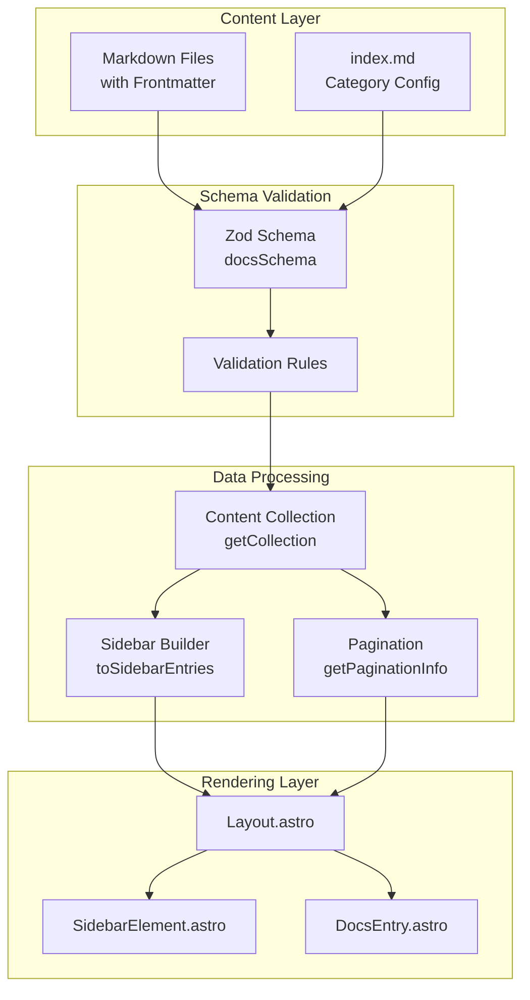
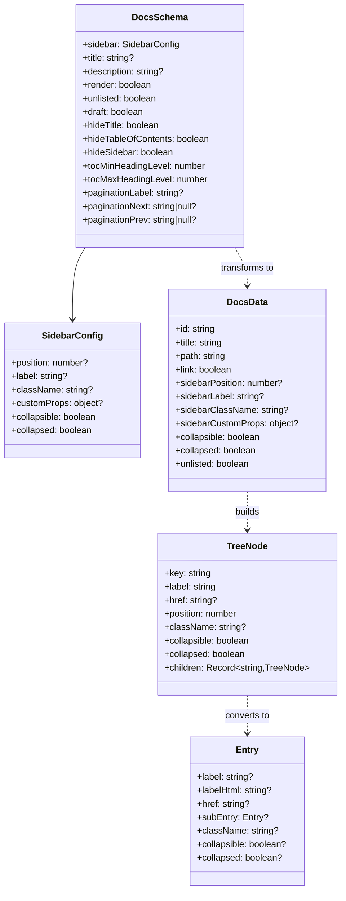

# Design Document: Astro-Native Category Metadata

## Overview

This design document describes the technical approach for implementing Astro-native category metadata in shipyard's docs package. The implementation replaces the non-functional `_category_.json` approach with a frontmatter-based system using `index.md` files as the single source of truth for category configuration.

The core architectural decision is to leverage Astro's content collections for all metadata, ensuring type safety, hot reloading, and build pipeline integration. All sidebar-related configuration fields will be grouped under a `sidebar` object in frontmatter, using camelCase naming conventions consistent with JavaScript/TypeScript standards. This design supports both rendered category landing pages and non-rendered sidebar-only entries, along with unlisted pages that render but remain hidden from navigation.

Key integration points include:
- **Zod schema** (`docsSchema` in `packages/docs/src/index.ts`) for frontmatter validation
- **Sidebar tree builder** (`sidebarEntries.ts`) for transforming docs data into navigation structure
- **Layout component** (`Layout.astro`) for rendering pages with correct sidebar state
- **SidebarElement component** (`packages/base/astro/components/SidebarElement.astro`) for collapse/expand behavior

---

## Architecture

### System Overview



### Data Flow

1. **Content Loading**: Astro's content collection loads markdown files and validates frontmatter against `docsSchema`
2. **Data Transformation**: `Layout.astro` fetches docs via `getCollection()` and transforms them into `DocsData` objects
3. **Sidebar Building**: `toSidebarEntries()` builds the hierarchical navigation tree with collapsible categories
4. **Pagination Computation**: `getPaginationInfo()` computes prev/next links, excluding unlisted pages
5. **Rendering**: Components render the page with sidebar, handling collapse states and non-rendered entries

### Component Relationships



---

## Components and Interfaces

### Component 1: Frontmatter Schema (`packages/docs/src/index.ts`)

**Responsibility**: Define and validate all frontmatter fields using Zod schemas with proper defaults, transformations, and cross-field validation.

**Interface Changes to `docsSchema`**:

```typescript
// New sidebar sub-schema with full configuration
const sidebarSchema = z.object({
  position: z.number().optional(),
  label: z.string().optional(),
  className: z.string().optional(),
  customProps: z.record(z.any()).optional(),
  collapsible: z.boolean().default(true),
  collapsed: z.boolean().default(true),
}).refine(
  (data) => !(data.collapsed === true && data.collapsible === false),
  { message: "sidebar.collapsed cannot be true when sidebar.collapsible is false" }
)

export const docsSchema = z.object({
  // Page Metadata
  id: z.string().optional(),
  title: z.string().optional(),
  description: z.string().optional(),
  keywords: z.array(z.string()).optional(),
  image: z.string().optional(),
  canonicalUrl: z.string().optional(),

  // Page Rendering
  render: z.boolean().default(true),
  draft: z.boolean().default(false),
  unlisted: z.boolean().default(false),
  slug: z.string().optional(),

  // Layout Options
  hideTitle: z.boolean().default(false),
  hideTableOfContents: z.boolean().default(false),
  hideSidebar: z.boolean().default(false),
  tocMinHeadingLevel: z.number().min(1).max(6).default(2),
  tocMaxHeadingLevel: z.number().min(1).max(6).default(3),

  // Sidebar Configuration (grouped)
  sidebar: sidebarSchema.default({ collapsible: true, collapsed: true }),

  // Pagination
  paginationLabel: z.string().optional(),
  paginationNext: z.string().nullable().optional(),
  paginationPrev: z.string().nullable().optional(),

  // Git Metadata Overrides (using camelCase)
  lastUpdateAuthor: z.union([z.string(), z.literal(false)]).optional(),
  lastUpdateTime: z.union([z.coerce.date(), z.literal(false)]).optional(),
  customEditUrl: z.string().nullable().optional(),

  // Custom Meta Tags
  customMetaTags: z.array(z.object({
    name: z.string().optional(),
    property: z.string().optional(),
    content: z.string(),
  })).optional(),
}).refine(
  (data) => data.tocMinHeadingLevel <= data.tocMaxHeadingLevel,
  { message: "tocMinHeadingLevel must be <= tocMaxHeadingLevel" }
)
```

**Key Design Decisions**:
- [R1] Sidebar fields grouped under `sidebar.*` for clear organization
- [R5] Cross-field validation using Zod's `refine()` method
- [R4] All fields optional with sensible defaults; title/description fallbacks handled in rendering layer
- camelCase naming throughout for JavaScript consistency

---

### Component 2: DocsData Interface (`packages/docs/src/sidebarEntries.ts`)

**Responsibility**: Define the intermediate data structure passed from content collection to sidebar builder.

**Interface Changes**:

```typescript
export interface DocsData {
  id: string
  title: string
  path: string
  link?: boolean              // false when render: false
  sidebarPosition?: number
  sidebarLabel?: string
  sidebarClassName?: string
  sidebarCustomProps?: Record<string, unknown>
  collapsible?: boolean       // NEW: from sidebar.collapsible
  collapsed?: boolean         // NEW: from sidebar.collapsed
  unlisted?: boolean          // NEW: for filtering from sidebar
  paginationLabel?: string    // NEW: for pagination display
  paginationNext?: string | null
  paginationPrev?: string | null
}
```

**Mapping from Frontmatter to DocsData** (in `Layout.astro`):

| Frontmatter Field | DocsData Field | Notes |
|-------------------|----------------|-------|
| `sidebar.position` | `sidebarPosition` | Direct mapping |
| `sidebar.label` | `sidebarLabel` | Falls back to title/H1 |
| `sidebar.className` | `sidebarClassName` | Direct mapping |
| `sidebar.customProps` | `sidebarCustomProps` | Direct mapping |
| `sidebar.collapsible` | `collapsible` | Default: true |
| `sidebar.collapsed` | `collapsed` | Default: true |
| `render` | `link` | Inverted: `link = render` |
| `unlisted` | `unlisted` | Direct mapping |
| `paginationLabel` | `paginationLabel` | For prev/next buttons |

---

### Component 3: Sidebar Tree Builder (`packages/docs/src/sidebarEntries.ts`)

**Responsibility**: Build hierarchical navigation tree from flat docs array, handling category metadata from index.md files, collapsible state, and filtering unlisted pages.

**Interface Changes to TreeNode**:

```typescript
interface TreeNode {
  readonly key: string
  readonly label: string
  readonly href?: string
  readonly position: number
  readonly className?: string
  readonly collapsible: boolean    // NEW
  readonly collapsed: boolean      // NEW
  readonly children: Readonly<Record<string, TreeNode>>
}
```

**Algorithm Updates**:

1. **Filter unlisted pages** [R3]: Before building tree, filter out docs where `unlisted: true`
   ```typescript
   const visibleDocs = docs.filter(doc => !doc.unlisted)
   ```

2. **Enhanced node creation for categories**:
   - When processing `index.md`, extract `collapsible` and `collapsed` values
   - Apply these to the parent category node
   - If `link === false`, set `href = undefined` (non-clickable) [R2]

3. **Merge behavior for index.md**:
   ```typescript
   const mergeNodeWithDoc = (node: TreeNode, doc: DocsData): TreeNode => ({
     ...node,
     label: doc.sidebarLabel ?? doc.title ?? node.label,
     href: doc.link !== false ? doc.path : undefined,  // [R2]
     position: doc.sidebarPosition ?? node.position,
     className: doc.sidebarClassName ?? node.className,
     collapsible: doc.collapsible ?? node.collapsible,
     collapsed: doc.collapsed ?? node.collapsed,
   })
   ```

4. **Output Entry structure**:
   ```typescript
   const treeNodeToEntry = (node: TreeNode): Entry[string] => ({
     label: node.label,
     ...(node.href && { href: node.href }),
     ...(node.className && { className: node.className }),
     ...(Object.keys(node.children).length > 0 && {
       collapsible: node.collapsible,
       collapsed: node.collapsed,
       subEntry: /* sorted children */
     }),
   })
   ```

---

### Component 4: Entry Type (`packages/base/astro/components/types.ts`)

**Responsibility**: Define the navigation entry structure consumed by sidebar components.

**Interface Changes**:

```typescript
export type Entry = Record<
  string,
  {
    label?: string
    labelHtml?: string
    href?: string
    subEntry?: Entry
    active?: boolean
    className?: string
    collapsible?: boolean  // NEW: can category be collapsed
    collapsed?: boolean    // NEW: initial collapsed state
  }
>
```

---

### Component 5: SidebarElement Component (`packages/base/astro/components/SidebarElement.astro`)

**Responsibility**: Render sidebar navigation items with collapse/expand functionality for categories.

**Current Behavior**: Categories always show children (no collapse support).

**Required Changes** [R1]:

1. **Render collapse toggle** when `collapsible: true` and `subEntry` exists
2. **Apply initial state** based on `collapsed` value
3. **Non-clickable categories**: When `href` is undefined, render as `<span>` not `<a>`

**Proposed Implementation Pattern**:

```astro
{Object.entries(entry).map(([key, entryValue]) => {
  const label = entryValue.label ?? key;
  const hasChildren = entryValue.subEntry && Object.keys(entryValue.subEntry).length > 0;
  const isCollapsible = hasChildren && (entryValue.collapsible !== false);
  const isCollapsed = entryValue.collapsed ?? true;

  return (
    <li class={entryValue.className}>
      {hasChildren && isCollapsible ? (
        <details open={!isCollapsed}>
          <summary>
            {entryValue.href ? (
              <a href={entryValue.href}>{label}</a>
            ) : (
              <span class="menu-title">{label}</span>
            )}
          </summary>
          <ul>
            <Astro.self entry={entryValue.subEntry} />
          </ul>
        </details>
      ) : hasChildren ? (
        // Non-collapsible category with children
        <>
          {entryValue.href ? (
            <a href={entryValue.href}>{label}</a>
          ) : (
            <span class="menu-title">{label}</span>
          )}
          <ul>
            <Astro.self entry={entryValue.subEntry} />
          </ul>
        </>
      ) : (
        // Leaf node
        entryValue.href ? (
          <a href={entryValue.href}>{label}</a>
        ) : (
          <span class="menu-title">{label}</span>
        )
      )}
    </li>
  )
})}
```

---

### Component 6: Pagination Logic (`packages/docs/src/pagination.ts`)

**Responsibility**: Compute prev/next navigation links, excluding unlisted pages.

**Required Changes** [R3]:

1. **Filter unlisted from flattenSidebarEntries**: Unlisted pages are already excluded from sidebar entries, so pagination naturally excludes them
2. **Support paginationLabel**: Use `doc.paginationLabel` in preference to `sidebarLabel` for display

```typescript
// In getPaginationInfo, when building result:
result.prev = {
  title: targetDoc.paginationLabel ?? targetDoc.sidebarLabel ?? targetDoc.title,
  href: targetDoc.path,
}
```

---

### Component 7: Layout.astro Data Transformation

**Responsibility**: Fetch docs from collection and transform to DocsData format with all new fields.

**Required Changes** in data mapping:

```typescript
const docs = await getCollection(collectionName as CollectionKey).then(
  EffectArray.map(async (doc) => {
    const {
      id,
      data: {
        title,
        sidebar,         // Now contains position, label, className, customProps, collapsible, collapsed
        render,          // New field
        unlisted,        // New field
        paginationLabel, // New field
        paginationNext,
        paginationPrev,
      },
    } = doc

    return {
      id,
      path: getPath(id),
      title: sidebar.label ?? title ?? /* H1 fallback */ ?? id,
      link: render,                          // false = non-clickable
      sidebarPosition: sidebar.position,
      sidebarLabel: sidebar.label,
      sidebarClassName: sidebar.className,
      sidebarCustomProps: sidebar.customProps,
      collapsible: sidebar.collapsible,
      collapsed: sidebar.collapsed,
      unlisted,
      paginationLabel,
      paginationNext,
      paginationPrev,
    }
  })
)
```

---

### Component 8: DocsEntry.astro Page Rendering

**Responsibility**: Handle `render: false` pages and page-level layout options.

**Required Changes**:

1. **Skip non-rendered pages** [R2]: In `getStaticPaths()`, filter out docs where `render: false`
   ```typescript
   export async function getStaticPaths() {
     const docs = await getCollection(collectionName)
     const renderableDocs = docs.filter(doc => doc.data.render !== false)
     return renderableDocs.map(entry => ({ ... }))
   }
   ```

2. **Apply layout options** from frontmatter:
   - `hideTitle`: Don't render auto-generated title
   - `hideTableOfContents`: Hide TOC component
   - `hideSidebar`: Use full-width layout
   - `tocMinHeadingLevel`/`tocMaxHeadingLevel`: Filter headings for TOC

---

### Component 9: Content Validation (`render: false` with content)

**Responsibility**: Validate that `render: false` pages have no content body.

**Approach** [R2, R5]: This validation must happen at build time. Two options:

**Option A: Custom Zod refinement with access to body** (Preferred)
- Astro's content collection does not expose `body` in schema validation
- Implement validation in the integration's `astro:build:start` hook

**Option B: Build-time validation in integration**
```typescript
'astro:build:start': async ({ logger }) => {
  const docs = await getCollection(collectionName)
  for (const doc of docs) {
    if (doc.data.render === false && doc.body?.trim()) {
      throw new Error(
        `[shipyard-docs] File "${doc.id}" has render: false but contains content. ` +
        `Files with render: false must not contain content below frontmatter.`
      )
    }
  }
}
```

**Recommendation**: Implement Option B in the shipyard-docs integration for clear error messages at build time.

---

### Component 10: Title/Description Fallback Logic

**Responsibility**: Implement fallback chains for title and description. [R4]

**Location**: In `Layout.astro` during DocsData transformation.

**Fallback Chains**:

| Field | Fallback Chain |
|-------|----------------|
| Sidebar Label | `sidebar.label` -> `title` -> H1 heading -> filename |
| SEO Title | `title` -> H1 heading -> filename |
| Meta Description | `description` -> first paragraph of content |

**Implementation**:

```typescript
// Extract H1 from rendered content
const { headings } = await render(doc)
const h1Heading = headings.find(h => h.depth === 1)?.text

// Apply fallback chain for sidebar label
const sidebarLabel = sidebar.label ?? title ?? h1Heading ?? doc.id

// For meta description fallback to first paragraph:
// This requires parsing the markdown body to extract first paragraph
// Implemented as a utility function
```

**Utility function for description fallback**:
```typescript
export const extractFirstParagraph = (body: string): string | undefined => {
  // Skip frontmatter (already stripped by Astro)
  // Find first non-empty line that's not a heading
  const lines = body.split('\n')
  const paragraphLines: string[] = []

  for (const line of lines) {
    const trimmed = line.trim()
    if (!trimmed) {
      if (paragraphLines.length > 0) break // End of first paragraph
      continue
    }
    if (trimmed.startsWith('#')) continue // Skip headings
    paragraphLines.push(trimmed)
  }

  return paragraphLines.length > 0 ? paragraphLines.join(' ') : undefined
}
```

---

## Migration Strategy

### Breaking Changes

1. **Field Naming**: All snake_case fields renamed to camelCase
2. **Sidebar Grouping**: Individual `sidebar_*` fields moved to `sidebar.*` object
3. **Removal**: `_category_.json` files no longer supported

### Backward Compatibility Period

To ease migration, consider a transitional approach:

**Option A: Hard Break** (Recommended for 0.x version)
- Remove old field names immediately
- Document migration steps clearly
- Provide a codemod script if feasible

**Option B: Deprecation Warnings**
- Accept both old and new field names
- Log deprecation warnings during build
- Remove old names in next major version

**Recommendation**: Given shipyard is pre-1.0, Option A is cleaner. Create a migration guide documenting:

1. Field name mappings (snake_case -> camelCase)
2. Grouped field restructuring (`sidebar_position` -> `sidebar.position`)
3. Conversion from `_category_.json` to `index.md` frontmatter

---

## Testing Strategy

### Unit Tests (Vitest) - `packages/docs/src/`

**New test files**:
- `schema.test.ts`: Validate Zod schema behavior
- Extend `sidebarEntries.test.ts`: Test new collapsible/unlisted logic
- `fallbacks.test.ts`: Test title/description fallback chains

**Test Cases for Schema**:
```typescript
describe('docsSchema', () => {
  it('accepts valid sidebar configuration')
  it('rejects collapsed: true with collapsible: false')
  it('rejects tocMinHeadingLevel > tocMaxHeadingLevel')
  it('applies correct defaults for sidebar')
  it('accepts all field types correctly')
})
```

**Test Cases for Sidebar Builder**:
```typescript
describe('toSidebarEntries with collapsible', () => {
  it('includes collapsible/collapsed in category entries')
  it('filters unlisted pages from sidebar')
  it('creates non-clickable entries for render: false')
  it('applies index.md metadata to parent category')
})
```

### E2E Tests (Playwright) - `apps/demos/*/tests/e2e/`

**New test file**: `category-metadata.spec.ts`

**Test Scenarios** [R1-R6]:

1. **Category Configuration via index.md**:
   - Category appears with correct `sidebar.label`
   - Category sorted by `sidebar.position`
   - Categories have collapse toggle when `collapsible: true`
   - Categories start collapsed/expanded per `collapsed` value

2. **Non-Rendered Pages** [R2]:
   - Sidebar entry exists for `render: false` page
   - Entry is not clickable (no href)
   - Navigating to URL returns 404
   - Category metadata still applies

3. **Unlisted Pages** [R3]:
   - Page renders at URL
   - Page not visible in sidebar
   - Page not in prev/next pagination

4. **Collapsible Behavior**:
   - Toggle expands/collapses children
   - Non-collapsible categories always show children
   - Active page's parent category is expanded

5. **Validation Errors** [R5]:
   - Build fails for `collapsed: true` + `collapsible: false`
   - Build fails for `render: false` with content

### Demo Application Updates

Create/update demo content in `apps/demos/i18n/` and `apps/demos/single-language/`:

```
docs/
├── category-demo/
│   ├── index.md          # sidebar: { position: 1, label: "Demo", collapsible: true, collapsed: false }
│   ├── child-page.md     # Regular page
│   └── unlisted.md       # unlisted: true
├── non-rendered-category/
│   └── index.md          # render: false, sidebar: { position: 2 }
├── always-open/
│   ├── index.md          # sidebar: { collapsible: false }
│   └── child.md
└── ...
```

---

## File Locations Summary

| Component | File Path |
|-----------|-----------|
| Zod Schema | `packages/docs/src/index.ts` |
| DocsData Interface | `packages/docs/src/sidebarEntries.ts` |
| Sidebar Builder | `packages/docs/src/sidebarEntries.ts` |
| Entry Type | `packages/base/astro/components/types.ts` |
| SidebarElement | `packages/base/astro/components/SidebarElement.astro` |
| Pagination | `packages/docs/src/pagination.ts` |
| Layout | `packages/docs/astro/Layout.astro` |
| DocsEntry | `packages/docs/astro/DocsEntry.astro` (generated) |
| Schema Tests | `packages/docs/src/schema.test.ts` (new) |
| Sidebar Tests | `packages/docs/src/sidebarEntries.test.ts` |
| E2E Tests | `apps/demos/i18n/tests/e2e/category-metadata.spec.ts` (new) |

---

## Security Considerations

1. **XSS Prevention**: `sidebar.customProps` values should not be rendered as HTML without sanitization
2. **Path Traversal**: `slug` field should be validated to prevent directory traversal attacks
3. **Content Injection**: `render: false` validation prevents content from being accidentally exposed

---

## Performance Considerations

1. **Build-time Validation**: All validation happens at build time, no runtime cost
2. **Sidebar Tree Building**: O(n log n) complexity maintained with sorting
3. **First Paragraph Extraction**: Only computed when `description` is missing and needed

---

## Open Questions

1. **Client-side collapse state persistence**: Should collapsed state be preserved in localStorage?
   - **Recommendation**: Start with server-rendered initial state; add persistence as future enhancement

2. **Active page parent expansion**: Should parent categories auto-expand when child is active?
   - **Recommendation**: Yes, implement in SidebarElement using existing `isActiveOrHasActiveChild` logic

3. **Custom sidebar component hook**: Should we expose `sidebar.customProps` for custom rendering?
   - **Recommendation**: Pass through to Entry; document how users can create custom SidebarElement

---

## Implementation Phases

**Phase 1: Schema and Data Layer**
- Update `docsSchema` with new structure
- Update `DocsData` interface
- Update `Entry` type

**Phase 2: Sidebar Builder**
- Add collapsible/collapsed to TreeNode
- Implement unlisted filtering
- Handle render: false entries

**Phase 3: Component Updates**
- Update SidebarElement with collapse UI
- Update Layout.astro data transformation
- Add build-time validation

**Phase 4: Testing and Documentation**
- Add unit tests
- Add E2E tests with demo content
- Update documentation
