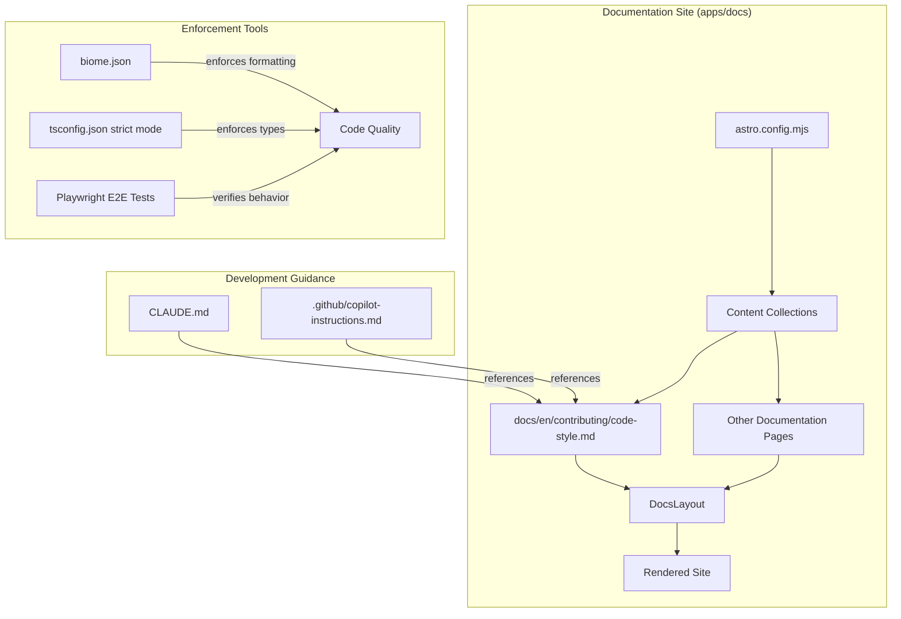

# Design Document

## Overview

This design document outlines the technical approach for creating a comprehensive Code Style Guide for the shipyard project. The solution involves creating a new documentation page at `apps/docs/src/content/docs/contributing/code-style.md` that serves as the authoritative reference for coding standards, along with updating `CLAUDE.md` to reference this guide.

The Code Style Guide will be structured as a single, well-organized markdown document that addresses all eight requirements from the requirements document. It will follow the existing documentation patterns in shipyard (using markdown with frontmatter) and integrate seamlessly with the existing docs package infrastructure. The guide will leverage concrete examples from the actual codebase to illustrate each principle, making the documentation both authoritative and practical.

Key architectural decisions include:
1. **Single Document Approach**: Rather than splitting across multiple files, the style guide will be a comprehensive single document organized with clear sections and a table of contents, matching the pattern of other shipyard documentation pages
2. **Codebase-Grounded Examples**: All code examples will be drawn from or inspired by actual shipyard code (e.g., `sidebarEntries.ts`, `pagination.ts`, `LlmsTxtSidebarLabel.astro`) to ensure relevance and accuracy
3. **Integration with Existing Tools**: The guide will reference and build upon existing tooling configuration (Biome, TypeScript strict mode, Playwright) rather than introducing new dependencies

## Architecture

The Code Style Guide integrates into the existing shipyard documentation architecture with minimal structural changes:



### Component Relationships

1. **Code Style Guide Document**: The primary deliverable (`apps/docs/src/content/docs/contributing/code-style.md`) containing all style guidelines organized into logical sections
2. **CLAUDE.md Updates**: Modifications to reference the new style guide and remove redundant content
3. **Sidebar Integration**: The new document automatically appears in the documentation sidebar via the existing `toSidebarEntries` function

### Data Flow

The documentation follows the standard Astro content collection flow:
1. Markdown content is authored with YAML frontmatter
2. Astro's content collection system processes the file
3. The docs package layout (`packages/docs/astro/Layout.astro`) renders the content
4. The sidebar entries are auto-generated from the file structure

### External Dependencies

No new external dependencies are required. The implementation uses:
- Existing Astro content collections
- Existing markdown processing pipeline
- Existing documentation layout components

## Components and Interfaces

### Component 1: Code Style Guide Document

**Location**: `apps/docs/src/content/docs/contributing/code-style.md`

**Responsibilities**:
- Serve as the single source of truth for shipyard coding standards
- Document all eight requirement areas with clear examples
- Provide both correct and incorrect code patterns for each guideline

**Interface (Frontmatter)**:
```yaml
---
title: Code Style Guide
sidebar_position: 1
sidebar_label: Code Style
description: Comprehensive coding conventions for shipyard contributors
---
```

**Structure**:
The document will be organized into the following sections, each addressing specific requirements:

#### Section 1: Introduction
- Purpose and audience [All Requirements]
- How to use this guide
- Quick reference summary table

#### Section 2: Functional Programming Principles [R1]
Addresses Requirement 1 (Functional Programming Style Documentation)

Content will include:
- **Pure Functions**: Explanation with examples from `sidebarEntries.ts` showing functions like `createLeafNode`, `createBranchNode`, and `mergeNodeWithDoc` that take explicit inputs and return explicit outputs without side effects
- **Immutability**: Examples showing spread operators and `reduce` patterns from the codebase (e.g., `insertAtPath` creating new objects rather than mutating)
- **Function Composition**: How `toSidebarEntries` composes smaller functions (`parseDocPath`, `insertAtPath`, `sortByPositionThenLabel`, `treeNodeToEntry`)
- **Side Effect Isolation**: Patterns showing how I/O operations are kept at component boundaries (Astro components) while pure logic lives in TypeScript utilities

Example content structure:
```markdown
### Pure Functions

Write functions with explicit inputs and outputs that always return the same
result for the same arguments:

**Correct Pattern:**
```typescript
const createLeafNode = (key: string, doc: DocsData): TreeNode => ({
  key,
  label: doc.sidebarLabel ?? doc.title ?? key,
  href: doc.link !== false ? doc.path : undefined,
  position: doc.sidebarPosition ?? DEFAULT_POSITION,
  children: {},
})
```

**Avoid:**
```typescript
let nodeCount = 0
const createLeafNode = (key: string, doc: DocsData): TreeNode => {
  nodeCount++ // Side effect!
  currentDoc = doc // Mutating external state!
  return { ... }
}
```
```

#### Section 3: Naming Conventions [R2]
Addresses Requirement 2 (Naming Conventions Documentation)

Content will include:
- **Variable Names**: Descriptive, full-word names that convey purpose
- **Function Names**: Names that describe what the function does or returns
- **Prohibited Patterns**: Single-letter variables, unclear abbreviations
- **Allowed Exceptions**: Loop counters in simple contexts
- **Self-Documenting Code**: How names eliminate the need for comments

Example content structure:
```markdown
### Variable Naming

Use descriptive names that convey purpose:

**Correct:**
```typescript
const normalizedCurrentPath = normalizePath(currentPath)
const sidebarLinks = page.locator('.drawer-side a')
const docsConfig = docsConfigs[normalizedBasePath]
```

**Avoid:**
```typescript
const p = normalizePath(path)  // Too short
const sl = page.locator('.drawer-side a')  // Abbreviation
const dc = docsConfigs[nbp]  // Multiple abbreviations
```
```

#### Section 4: Documentation Through Code [R3]
Addresses Requirement 3 (Documentation Through Code Policy)

Content will include:
- **No JSDoc Policy**: Clear statement that JSDoc is not used
- **Rationale**: Why comments become stale and misleading
- **Alternatives**: Clear naming and TypeScript types as documentation
- **Limited Comment Use Cases**: Complex algorithms, external API quirks, regulatory requirements

Example structure:
```markdown
### The Problem with Comments

Comments often describe "what" instead of "why" and become outdated:

```typescript
// BAD: This comment will become stale
// Get the title from the document or fall back to the key
const label = doc.sidebarLabel ?? doc.title ?? key
```

The code already says what it does. Instead, write code that needs no explanation:

```typescript
// GOOD: Self-explanatory through naming
const displayLabel = doc.sidebarLabel ?? doc.title ?? key
```
```

#### Section 5: Web Components and Native APIs [R4]
Addresses Requirement 4 (Web Components and Native APIs Documentation)

Content will include:
- **Preferred Approach**: Web components and custom elements
- **Framework Restrictions**: No React, Svelte, jQuery for interactive components
- **Benefits**: Smaller bundles, better Astro integration, progressive enhancement
- **Implementation Pattern**: Based on `LlmsTxtSidebarLabel.astro` example

Example structure:
```markdown
### Creating Interactive Components

Use native browser APIs with custom elements:

```typescript
// In an Astro component's <script> tag
class LlmsTxtLabel extends HTMLElement {
  connectedCallback() {
    const href = this.dataset.href
    if (!href) return

    const button = this.querySelector('button')
    if (!button) return

    button.addEventListener('click', async (event) => {
      event.preventDefault()
      const fullUrl = new URL(href, window.location.origin).toString()
      await navigator.clipboard.writeText(fullUrl)
    })
  }
}

customElements.define('llms-txt-label', LlmsTxtLabel)
```
```

#### Section 6: Testing Requirements [R5]
Addresses Requirement 5 (Integration Testing Requirements Documentation)

Content will include:
- **Feature Completeness**: Tests required for every feature
- **Demo Apps as Fixtures**: How demo apps serve as test fixtures
- **E2E Test Structure**: Playwright patterns from the codebase
- **Data Attribute Selection**: Using `data-*` attributes for element selection
- **Behavior Testing**: Focus on actual output, not implementation

Example structure:
```markdown
### Element Selection

Use data attributes rather than class names or text content:

```typescript
// GOOD: Data attribute for test selection
const editLink = page.locator('a.edit-link')
const lastUpdated = page.locator('.last-updated')

// AVOID: Brittle text-based selection
const editLink = page.locator('a:has-text("Edit this page")')
```
```

#### Section 7: Effect-TS Usage [R6]
Addresses Requirement 6 (Effect-TS Library Usage Documentation)

Content will include:
- **Purpose**: Functional pipes and compositions
- **Common Patterns**: `Array.map`, `Option.getOrUndefined`, `Array.findFirst`
- **When to Use**: Complex transformations, option handling
- **Integration with Astro**: Examples from `Layout.astro`

Example structure:
```markdown
### Effect Array Operations

Use Effect's Array module for functional transformations:

```typescript
import { Array as EffectArray, Option } from 'effect'

// Finding first matching element
const firstH1 = Option.getOrUndefined(
  EffectArray.findFirst(
    headings,
    ({ depth }) => depth === 1,
  ),
)

// Mapping with Effect
const processedDocs = await getCollection(collectionName)
  .then(EffectArray.map(async (doc) => ({
    id: doc.id,
    title: doc.data.title,
    // ...
  })))
```
```

#### Section 8: TypeScript Standards [R7]
Addresses Requirement 7 (TypeScript Standards Documentation)

Content will include:
- **Strict Mode**: All code in strict TypeScript
- **Type Inference**: When to rely on inference vs explicit types
- **Avoiding `any`**: Alternatives and proper typing
- **Types as Documentation**: How types serve as living documentation

Example structure:
```markdown
### Type Definitions as Documentation

Types describe the shape of data better than comments:

```typescript
// Interface documents the structure clearly
interface TreeNode {
  readonly key: string
  readonly label: string
  readonly href?: string
  readonly position: number
  readonly className?: string
  readonly children: Readonly<Record<string, TreeNode>>
}
```
```

#### Section 9: Astro Content Loaders [R8]
Addresses Requirement 8 (Astro Content Loaders Documentation)

Content will include:
- **Avoid Direct File Access**: No `fs.readFile` for content
- **Content Loaders**: Astro's content collection system
- **Why This Matters**: Type safety, caching, consistency
- **Exception Cases**: Build-time scripts, non-content files

Example structure:
```markdown
### Loading Content

Use Astro's content collections, not direct file access:

```typescript
// GOOD: Content collections
import { getCollection, render } from 'astro:content'

const docs = await getCollection('docs')
const { Content } = await render(docs[0])

// AVOID: Direct file system access
import { readFile } from 'fs/promises'
const content = await readFile('./docs/page.md', 'utf-8')
```
```

### Component 2: CLAUDE.md Updates

**Location**: `/workspaces/shipyard-code-style-guide/CLAUDE.md`

**Responsibilities**:
- Reference the Code Style Guide as the authoritative source
- Remove redundant style guidelines that will be in the new document
- Maintain development workflow and tooling information

**Changes Required**:
1. Add reference to the Code Style Guide in the "Code Style Guidelines" section
2. Keep tooling-specific information (Biome commands, etc.)
3. Link to the documentation for detailed conventions

**Updated Section Structure**:
```markdown
### Code Style Guidelines

For comprehensive coding conventions, see the
[Code Style Guide](apps/docs/docs/en/contributing/code-style.md).

Key tooling:
1. **Formatting & Linting**: Use Biome (configured in `biome.json`)
   - Run `npx @biomejs/biome@2.2.3 check --write .` before committing

2. **TypeScript**: Strict mode enabled with Astro's strict TypeScript config

3. **Testing**: Playwright E2E tests verify all features
   - Run `npm run test:e2e` before pushing
```

### Component 3: Contributing Directory Structure

**Location**: `apps/docs/docs/en/contributing/`

**Responsibilities**:
- Organize contribution-related documentation
- May include future documents (e.g., PR guidelines, architecture overview)

**Files**:
```
apps/docs/docs/en/contributing/
  code-style.md      # The Code Style Guide (primary deliverable)
```

### Integration Points

1. **Sidebar Navigation**: The contributing section automatically appears in the documentation sidebar through the existing `toSidebarEntries` function
2. **Localization**: The structure supports future i18n by placing content under `en/` locale directory
3. **Search**: The content is automatically indexed by any documentation search features

### Requirements Traceability Matrix

| Requirement | Document Section | Key Content |
|-------------|------------------|-------------|
| R1: Functional Programming | Section 2 | Pure functions, immutability, composition, side effect isolation |
| R2: Naming Conventions | Section 3 | Descriptive names, prohibited patterns, exceptions |
| R3: Documentation Through Code | Section 4 | No JSDoc policy, alternatives, limited comment use cases |
| R4: Web Components | Section 5 | Custom elements, framework restrictions, implementation pattern |
| R5: Testing Requirements | Section 6 | Feature completeness, data attributes, behavior testing |
| R6: Effect-TS Usage | Section 7 | Pipes, compositions, common patterns |
| R7: TypeScript Standards | Section 8 | Strict mode, type inference, avoiding `any` |
| R8: Astro Content Loaders | Section 9 | Content collections, avoiding file access |

### Testability Considerations

The Code Style Guide itself is documentation, but its effectiveness can be verified through:
1. **Code Review Checklist**: The guide provides clear criteria for code reviews
2. **Linting Alignment**: Guidelines align with Biome configuration to enable automated enforcement where possible
3. **Codebase Consistency**: Examples in the guide are drawn from actual codebase patterns, ensuring relevance

### Security Considerations

The Code Style Guide promotes security best practices:
- TypeScript strict mode helps prevent type-related vulnerabilities
- Testing requirements ensure security-critical features are verified
- No external dependencies reduces supply chain risks

### Maintainability

The design ensures long-term maintainability:
- Single document is easier to update than scattered guidelines
- Examples from actual code can be verified against the codebase
- Clear section structure allows targeted updates
- CLAUDE.md reference means AI assistants always find current guidelines
